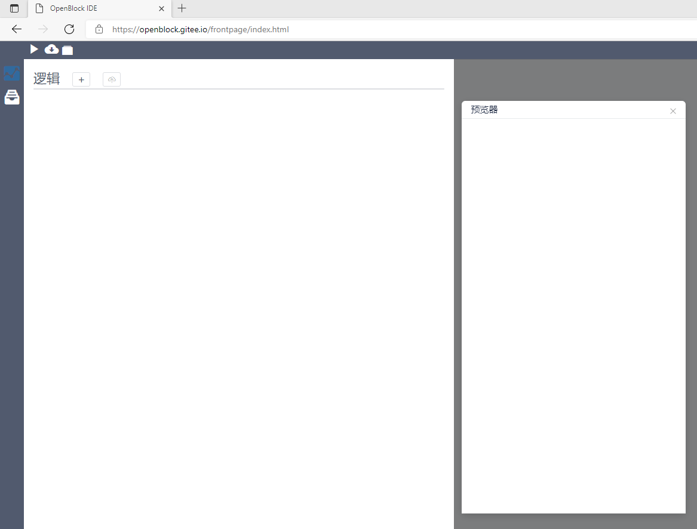
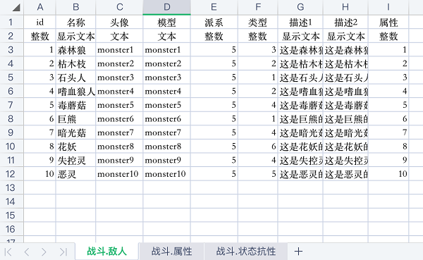
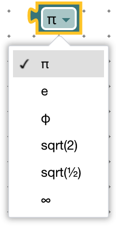

# 快速上手   

在浏览器搜索框输入以下网址：   
地址一：https://www.makeredu.net/frontpage/index.html   
地址二：https://mlzone.areyeshot.com/openblock/frontpage/index.html   

即可 直接 进入开发设计界面   

   

   

点击右上角 运行按钮    
   

可以看到启动 预览器 展示页，并停留在空页面状态   

   

点击左上角 逻辑 图标，打开逻辑模块列表。

    
   

点击 新建模块 按钮  

   
  

默认创建 **start** 模块   

  

点击新建状态机

  

默认新建后的状态机为 **Main**

  

点击 状态 文字标识进入块儿逻辑编程界面   
	（备注：具有 小黑旗 标志的是 初始状态）

      
 

# 基本概念

molang 是一种面向有限状态机编程的语言。   
区别于Java等面向对象语言，molang 中的对象指代有限状态机实例，而非类的实例。   
molang 中没有类的概念。   

***有限状态机***   
---
molang 将所有逻辑抽象为有限状态机。（https://zh.wikipedia.org/wiki/有限状态机）   
一个完整的项目由多个逻辑模块组成，每个逻辑模块由多个有限状态机（简称状态机）组成，每个状态机由多个状态组成。状态机为 molang 最小可执行单元，必须先创建状态机才能执行。
有限状态机的设计模型有利于对复杂需求的理解和设计。   
例如：   
在多人对战游戏中，每个人都有自己血量、防御力、攻击力等，每个人有自己的行为。每个人当前的状态都是从游戏开局到当前时刻所经历的事件叠加的结果。每个人根据不同的经历可以有待命状态，进攻状态、受击状态、追击状态等。我们可以将游戏对战作为一个逻辑模块，设计一组状态机，分别控制健康、行为、死亡和重生等。参与游戏的每个人，都是一组状态机组成的实例。   
在复杂的系统中，一个状态机用于专门完成一项业务，多个状态机配合完成一套业务逻辑。业务逻辑关联性较低的，可以分成不同的模块进行开发。每个模块是一个文件，多人团队配合需要按功能划分模块，进行开发。以避免多人修改一个文件，在版本控制中产生冲突。   
在模块属性中可以设定模块之间的依赖。模块之间只能单向依赖，如果A依赖B，则B不能依赖A，无论直接或者间接依赖都不可以。   
模块可以使用其直接依赖的其他模块中的数据结构和函数。   

***变量***   
---
molang 使用强类型系统，数据结构之间不可转换。对于宿主语言（如C#），UBlockly尽量保持按照宿主语言的类型规则进行匹配。   
UBlockly提供3种变量作用域分别是：局部变量、状态变量、状态机变量。   
函数内部可以访问已经声明过的局部变量；   
状态中任意事件处理代码块、消息处理代码块、方法，都可以访问当前状态变量和状态机变量；   
每个状态只能访问自己的状态变量和状态机变量；   
状态机之间不能访问变量，只能收发消息。  

***状态和事件***   
---
在有限状态机模型中，状态是状态机最核心的组成元素。状态机由1个或多个状态组成。状态机启动之后，会处于第一个状态中，并执行状态初始化的逻辑（即“开始”模块引导的语句块）。状态可以接受事件或消息，并对该事件或消息进行反馈和反应。反应的逻辑可以将状态机切换到另外一种状态。   
例如：   
游戏中待命状态的角色，收到发现敌人的消息，可能会根据情况的不同进入进攻、防御或者逃跑状态。   
状态机自己不会主动切换状态，但是可以预设切换的条件，比如：倒计时完成、发现敌人、收到某个消息等。   

***函数***   
---
函数是可以被调用的代码块，用于代码的复用。提升开发效率和代码的可读性、可维护性。   
函数可以是依附于特定状态或状态机之上的可调用代码块，可以读取或修改状态或状态机上的变量值。   

   

函数也可以是独立于状态机的可调用代码，可以被任意代码调用。因为没有依附于特定的状态或状态机，所以不可以读写状态或者状态机上的变量。   

***数据结构***
---
数据结构是 molang 区别于其他图形化编程语言的重要特点。   
molang 使用类似C语言中结构体的方式管理数据。数据结构与业务逻辑分离。   
每个模块中，都可以独立于有限状态机之外定义数据结构。  

   

molang 中定义的基本类型有：整数、数字、布尔、字符串、状态机   
组合类型有：列表、字符串映射、数字映射 和 结构体   
定义数据结构之后，可通过数据结构相关的块读写数据结构的内容。  

   

   

***数据集***
---
软件开发中经常需要定义大量的数据，比如 游戏世界中的怪物、电商平台中的商品。这些是在游戏开始之前、商品销售之前就需要定义好的数据。这些数据通常来自于运营、策划、设计等部门，数据结构清晰、需要统一管理。程序根据这些数据来执行任务，   
如：根据游戏策划表中的怪物种类、等级、坐标等信息，将怪物绘制到地图上。   
molang 中可导入Excel，UBlockly会根据逻辑中的数据结构，扫描Excel的表头生成代码可读取的数据集。   
如：上图的敌人、属性、关卡、敌人配置等，可用以下格式Excel配置：   

molang 根据表格的名称适配对应的数据结构，并根据表头的列名适配字段。第二行的数据类型可省略。   
点击数据按钮

点击导入Excel，在弹出的文件选择框中一次性选择需要导入的Excel文件。

导入Excel后，可在数据管理中查看识别的数据。

在逻辑代码中可通过从数据集中加载数据的块读取数据集

# 逻辑块功能   

## 事件   

***开始***
---   

每个状态可以最多有一个开始块，当状态机每次切换到本状态时会执行“开始”块之下链接的代码。   

***鼠标***
---    

鼠标事件只会在开启碰撞体的物体上触发。   

   

当鼠标对准当前挂载状态机的对象按下时，执行链接到下边的代码。   

  
***拾取***
---   

当模型被标记为可拾取，则可以在被拾取和放下的时候触发拾取和放下事件。   

***键盘***
---  

当键盘上有按键被按下时会触发按下按键事件。同时，直到按键抬起前，每一帧都会收到按住按键事件。   

 

***碰撞***
---  

当模型开启物理属性后，与其他物理物体发生碰撞时候会触发碰撞进入和碰撞离开的事件。   
当模型开启触发器属性后，与其他物理物体发生碰撞时候会触发 碰撞触发器进入、停留、离开的事件。   

## 消息   

***消息发送***
---   

   

可以向指定状态机发送或者全部其他状态机广播消息，通过附加数据，可以向目标发送数据。

***消息接收***   
---   

   

当状态机收到消息时，通过“当收到消息”块接收消息。   
如果希望接收附加数据可以通过限制附加数据的类型，筛选出匹配类型的消息。   

如果不做附加数据类型限制，则无论是否有附加数据、无论附加数据是什么类型，都会触发事件。

   

通过附加数据块，可在接收消息块的作用范围内获取收到的附加数据。   

附加数据块的类型，与其对应接收块限定的类型相同。

“附加数据”块在未限定附加数据类型的逻辑里不可使用。   

***状态机控制***
--- 

  

当前状态机切换到目标状态。   
可用的状态来自于状态机的状态列表：   

  

 

获取当前正在运行的状态机。通常用于给自己发送延迟消息。   

创建状态机，并获取引用。   
可指定的状态机类型来自于全部模块中所有的状态机：

销毁当前状态机。状态机将停止接受任何事件和消息并被删除。   

## 调试   

在日志中输出文字内容。

## 文字

单行或多行文本内容。

将一组内容转成文字形式并连接到一个文本数据中。   

## 布尔

如果否则块，是分支条件判断的语句，顺序判断每个“如果”条件，当条件满足时执行对应的“执行”语句块。   

如果所有的“如果”条件都不满足，则执行“否则”中的语句块。   

“如果”条件必须为布尔值类型的语句或值。

数学比较块。如果满足比较条件，则为真，否则为假。

“并且”表示两侧的布尔值都为真，则为真，否则为假。   
“或”表示 先判断左侧的布尔值，如果为真，则本指令值为真，否则与右侧布尔值相同。

当布尔语句为真时，本指令为假；当布尔语句为假时，本条语句为真。

获取 “真”或“假”值   

## 循环

重复执行“执行”对应是语句块若干次；

当条件满足/不满足时一直重复执行   

当i从1开始，执行“执行”语句块，每次完成后i增加1，直到i为10时停止。

用于跳出当前循环，或跳过当前循环步骤。   

## 数学

双精度实数

双精度整数   

    

  

 
   
 

数学运算   

常用数学常数

生成随机数。   

## 颜色   

使用指定颜色。

## 函数（方法）

定义可重复使用的计算过程。

返回值类型限定了函数必须具有该类型的返回值。   
如果不设定返回值类型，则返回指令不可设置值。   
参数为调用者必须传递给函数的值，这些值可以在函数内部使用。   

调用函数（方法）   
可以调用指定的方法。   
“调用方法”块会根据所选择的函数不同，改变成不同的外观。

## 状态机变量、状态变量

   

状态机变量为生命周期伴随整个状态机存在的变量。

   

状态变量的生命周期只伴随当前状态。离开当前状态后，变量不再存在。   
点击“创建变量”按钮可创建对应作用域的变量。   

  

## 局部变量   

局部变量只可在当前语句块范围内使用，并且必须在创建的时候设置值。   

同时，在循环中也可以使用循环块创建的局部变量。

