# 跳一跳游戏制作

&ensp;&ensp;&ensp;&ensp;本文将使用 OpenBlock 语言实现微信小游戏《跳一跳》的基本功能。

&ensp;&ensp;&ensp;&ensp;原游戏在微信小游戏平台构建，使用平台提供的 3D 功能。为了重点体现游戏设计和制作的核心流程，我们简化了开发内容，在 2D 环境实现跳一跳的全部业务，为了简化开发，使用圆形、矩形表示角色，使用线框立方体表示平台呈现 2.5D 效果。
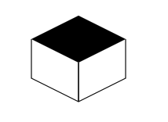

## 业务分析

### 操作流程

- 玩家进入游戏后，首先看到“开始游戏”界面，点击“开始游戏”按钮，进入游戏场景。当玩家掉下平台，显示本次得分，并显示“再玩一局”按钮。玩家可以通过点击“再玩一局”按钮重新进入游戏场景。得分不累加。
- 跳一跳效果是接受玩家触摸屏幕事件，开始计时，并在松开手指时开始让角色跳跃。跳跃的距离根据玩家触摸屏幕时间长度决定。触摸时间越短，跳跃距离越短；时间越长，距离越长。但是触摸时间有最大上限，达到时间上限之后，计时不再累加。跳跃高度为固定高度。

### 游戏规则

#### 基本概念：

- 参与游戏的用户称为玩家。
- 玩家控制的跳跃对象称为角色。
- 角色可站立的方块称为一阶平台。

#### 游戏过程：

- 设定游戏从角色站立、压缩、起跳、落地，为一个回合。每个回合起始时，在屏幕上绘制 2 个平台，向左前或右前 45 度角摆放。
- 每个回合开始时，移动视野，将视野中心对准角色所站平台和下一阶平台之间。
- 玩家只能看到跳过的平台、当前站立的平台和下一阶平台。每跳跃一阶平台，随机在左前方或者右前方出现下一阶平台，与当前平台的在一个范围内随机。由于看不到之后的平台，角色不能一次跳跃 2 阶平台。
- 第一个回合，角色所站平台为第一阶，第二阶平台为右前方。从第三阶平台开始，为随机方向。
- 角色将由玩家控制，站在近处平台向前方平台上跳跃。
- 玩家按下屏幕（或其他交互方式），平台和角色同时压缩。当压缩到最大值时，停止压缩。
- 无论是否压缩到最大值，玩家手指离开屏幕时，平台和角色同时弹起。
- 弹起到最大值后，角色向上、向下一阶平台方向跳起。并向前跳跃一定距离。距离依据压缩值计算得出。
- 角色落下后，判定当前回合得分。如果角色落到起跳所在平台，不得分，游戏继续。如果角色落到下一阶平台，则为得分，游戏继续。如果角色没有落在平台上，判定掉下平台，游戏结束。

### 技术设计

#### 功能拆解

&ensp;&ensp;&ensp;&ensp;通过对游戏规则分析，我们可以得出，游戏需要的功能包括：UI，坐标、平台、角色和用户交互，5 个功能模块。

- UI 模块负责向玩家展示游戏状态、积分。
- 使用坐标，我们可以模拟出摄像机移动的效果，轻易的改变视野。
- 将平台基于我们自己的坐标系统进行位置计算，而不是屏幕的坐标系统，以便于对平台进行位移的操作。
- 将角色与平台放于同一坐标系统中进行计算，我们可以简单的计算角色落地点是否处于平台上。
- 用户交互模块用于接收屏幕被按下等操作并将操作传递给角色、平台等模块。
- 为了简化计算和支持未来有可能的不规则形状平台，无论起跳点位于上一阶的什么位置，如果落地点不在上一阶平台上，那么一定在上一阶平台与下一阶平台的中点连线所在的直线上。

#### 模块设计

- 游戏控制
  &ensp;&ensp;&ensp;&ensp;控制游戏最外层的逻辑，比如启动首页、当游戏结束后显示得分页。
- 坐标系统
  &ensp;&ensp;&ensp;&ensp;跳一跳游戏的坐标系统很简单，甚至不能称之为系统，只是给每个需要绘制的内容增加一个坐标偏移量即可。
- 平台
  &ensp;&ensp;&ensp;&ensp;简化的平台只需要根据坐标绘制可变高度的立方体效果即可。高度跟随用户触摸屏幕时长改变。
- 角色
  &ensp;&ensp;&ensp;&ensp;角色模块与平台模块类似。
- 用户交互
  &ensp;&ensp;&ensp;&ensp;用户交互简化为点击屏幕。不设计按钮效果。交互系统比较简单，直接使用事件系统就可以。
- UI
  &ensp;&ensp;&ensp;&ensp;UI 只需要显示得分和开始游戏、重新开始的文字即可。

#### 角色

&ensp;&ensp;&ensp;&ensp;根据之前对角色的设计，我们可以把角色的功能再进行拆分。首先我们把角色的逻辑和绘制区分开。
&ensp;&ensp;&ensp;&ensp;根据用户操作的流程，我们可以把角色拆分为 等待、压缩、弹起、下落、落地，5 个状态。留个状态中都需要对角色进行绘制。我们可以总结出在这 5 种状态中绘制角色，只有两个不同：位置和压缩。位置代表了角色在屏幕空间的以左上角为原点偏移量 x 和 y，压缩代表了角色在压缩、弹起过程的形变。我们可以创建一个状态机，设立角色的五种状态。
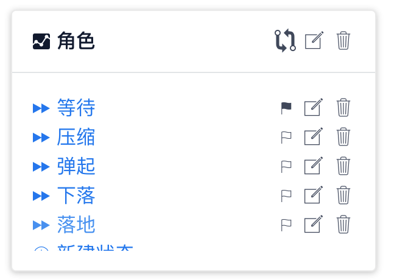
&ensp;&ensp;&ensp;&ensp;所以在绘制方面我们只需要根据坐标和高度在屏幕画出简单的圆形和矩形即可。所以我们定义一个绘制角色的函数，需要 x 坐标、y 坐标、高度三个参数。
&ensp;&ensp;&ensp;&ensp;绘制比较简单，也不依赖任何状态，我们可以在状态机外创建一个“绘制”函数组。并在其中创建函数“绘制角色”：
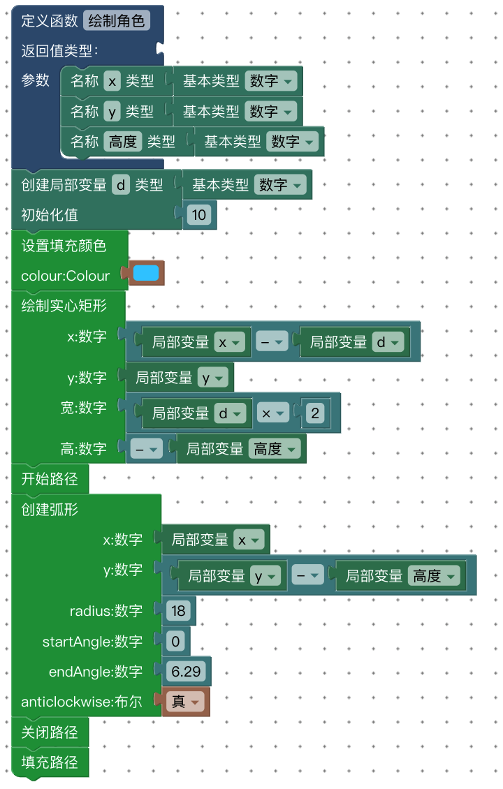

#### 平台

&ensp;&ensp;&ensp;&ensp;相对于角色来说，平台只有压缩、不压缩两个状态，逻辑比较简单。

&ensp;&ensp;&ensp;&ensp;平台的形象是个立方体，绘制比较复杂。由于在功能上同样属于绘制，所以我们在“绘制”函数组里增加“绘制平台”函数。
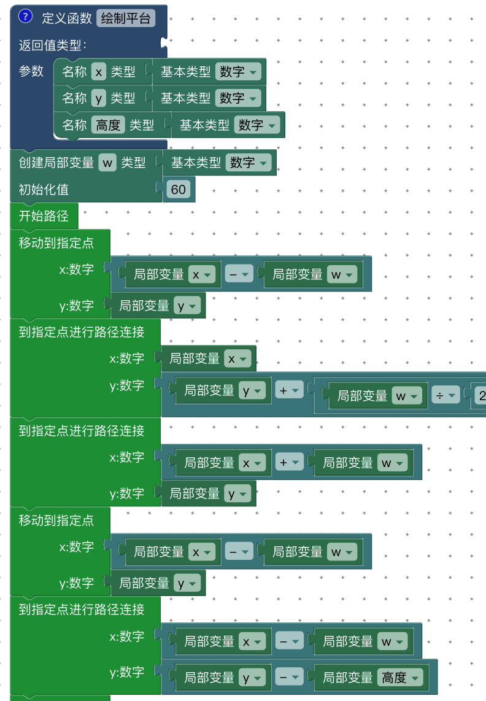

省略中间。。。

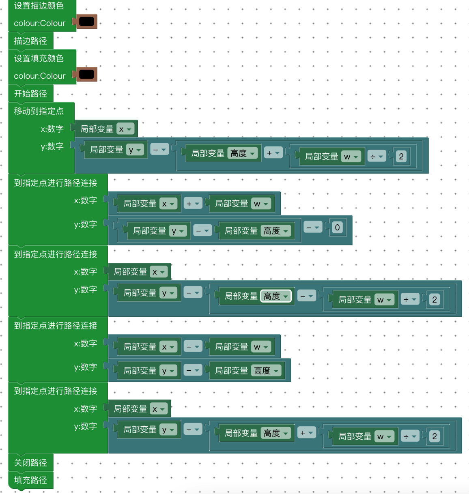

&ensp;&ensp;&ensp;&ensp;这里只展示首尾部分，大概思路是分开绘制每条线段，再绘制顶面。顺序不重要。
&ensp;&ensp;&ensp;&ensp;“绘制”函数组里拥有 2 个函数：
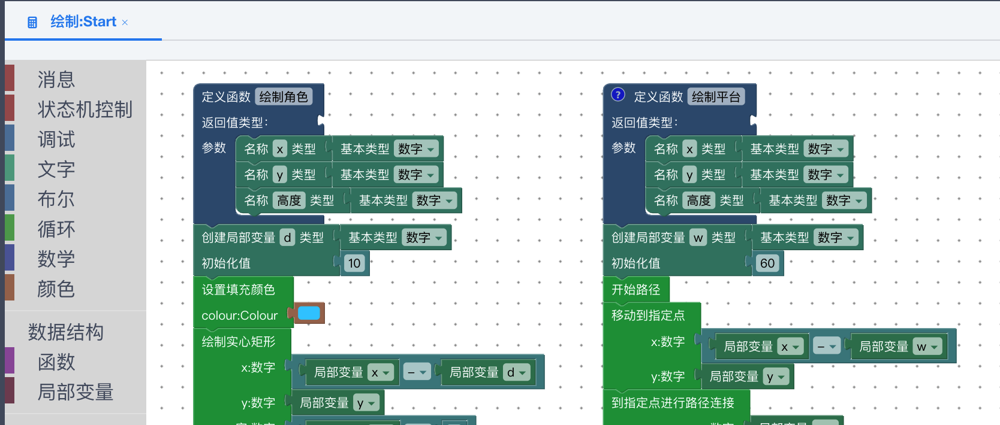

&ensp;&ensp;&ensp;&ensp;在 Start.Main 状态机的起始状态中添加绘制平台和角色的测试代码。运行效果：
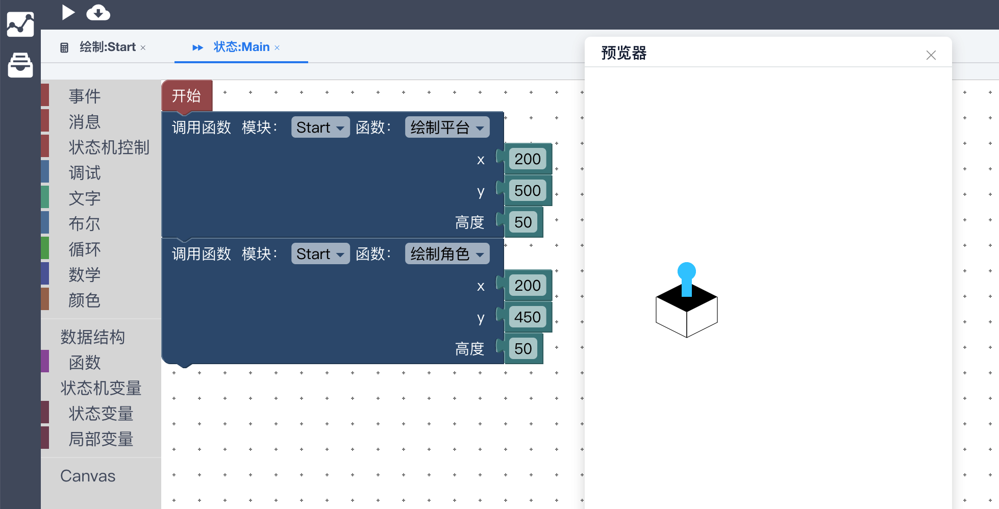

#### 游戏控制

&ensp;&ensp;&ensp;&ensp;游戏控制是掌控整个游戏全局宏观状态的模块，将游戏分为 启动、游戏过程、结束，三个状态。进入游戏的时候是启动状态；点击屏幕进入游戏过程状态；角色掉下平台进入结束游戏状态；再次点击屏幕重新进入游戏过程。

#### UI

&ensp;&ensp;&ensp;&ensp;UI 是跟随游戏状态进行变化的，在 启动、过程、结束 三个状态，分别显示不同的界面结构。由于计分逻辑非常简单，我们也把计分的功能写到 UI 里。

&ensp;&ensp;&ensp;&ensp;整体代码结构：
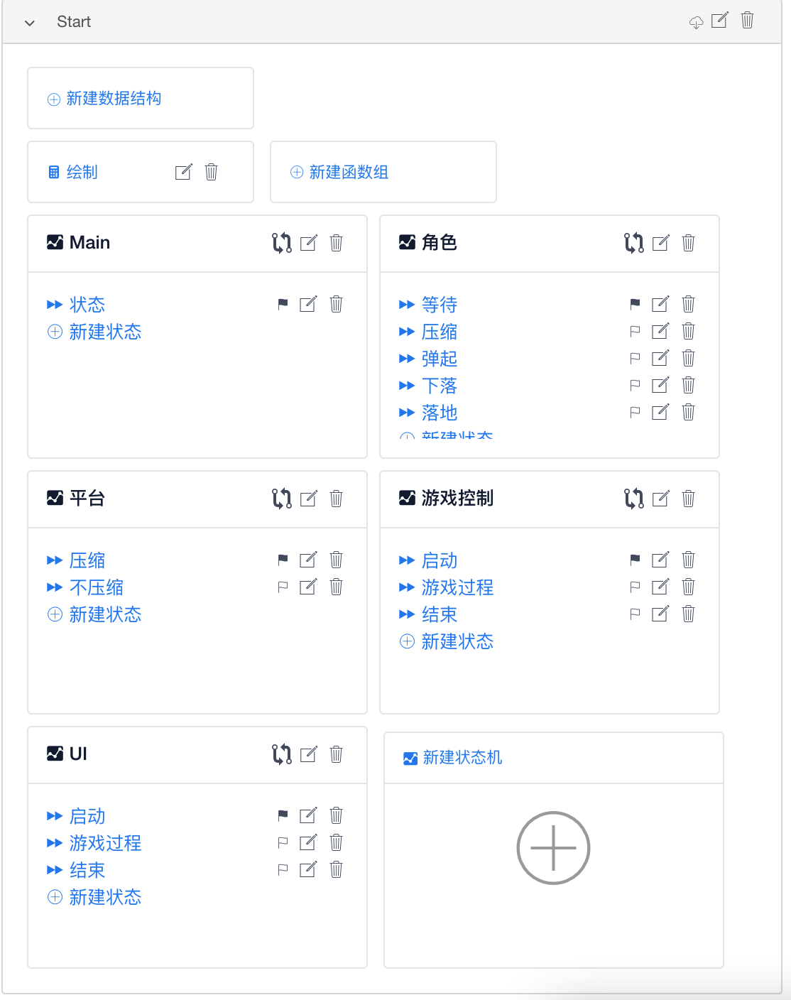

## 代码实现

### 游戏控制

&ensp;&ensp;&ensp;&ensp;在 Main 状态机中添加创建“游戏控制”状态机的逻辑，用来引导游戏启动。

#### 启动

&ensp;&ensp;&ensp;&ensp;启动的逻辑非常简单，只需要创建一个 UI 状态机，并且监听点击事件就可以了。
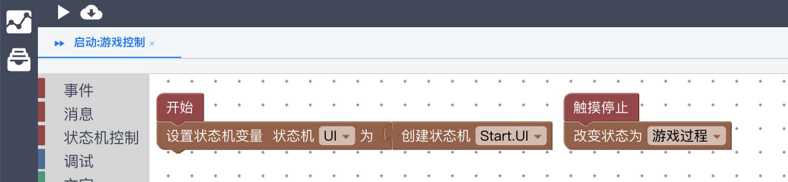

#### 游戏过程-1

&ensp;&ensp;&ensp;&ensp;游戏过程涉及到初始化过程和渲染刷新，是比较复杂的地方。但是我们先不考虑那么多，只把游戏控制大概的框架搭好，细节的逻辑以后再补充。眼前要做的就是先创建一个角色，然后广播个“游戏开始”消息。同时要监听“掉下平台”消息，以便当角色掉下平台的时候进入结束状态。
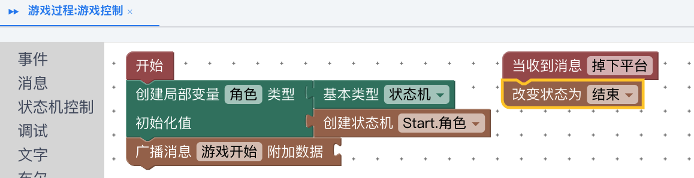

#### 结束

&ensp;&ensp;&ensp;&ensp;游戏结束之后只需要监听玩家点击屏幕，然后回到游戏过程，重新开始游戏。

#### 检查状态转换

&ensp;&ensp;&ensp;&ensp;游戏控制模块的我们已经框架我们已经搭建完成了。通过查看状态转换来验证我们的设计。

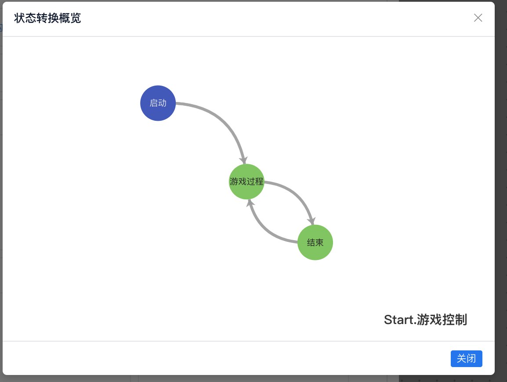

&ensp;&ensp;&ensp;&ensp;从图中我们可以看到，确实是按照我们的设计，游戏从启动，到游戏过程，到结束，再回到游戏过程，说明流程上没有问题。

### 启动
&ensp;&ensp;&ensp;&ensp;游戏启动的时候，只需要UI提示“点击屏幕开始”就可以了。
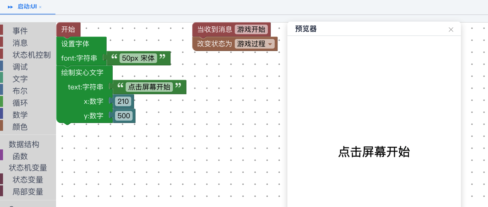

### 游戏过程
#### UI 1
&ensp;&ensp;&ensp;&ensp;游戏开始之后，UI就开始在左上角绘制当前得分。
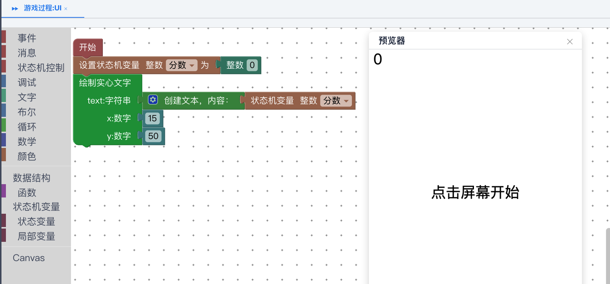
我们可以看到，左上角显示了当前的分数。但是“点击屏幕开始”仍然留在屏幕上。
#### 游戏过程 2
&ensp;&ensp;&ensp;&ensp;因为绘制画板是不会自动清空的，所以每次要绘制的新的内容，都会叠加在旧的内容上，而旧的内容不会消失。那么我们需要主动清空不需要的内容。我们可以在游戏控制模块中增加一个重新绘制的信号。
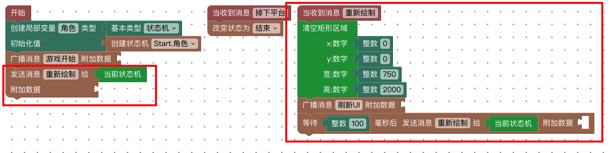

&ensp;&ensp;&ensp;&ensp;从进入“游戏过程”状态开始，每间隔100毫秒，给自己发送一条“重新绘制”的消息。在收到这个消息后，清除屏幕上所有的内容，并向外广播“刷新UI”。
#### UI 2
&ensp;&ensp;&ensp;&ensp;当我们有了“刷新UI”消息之后，就可以在UI里接受这条消息。
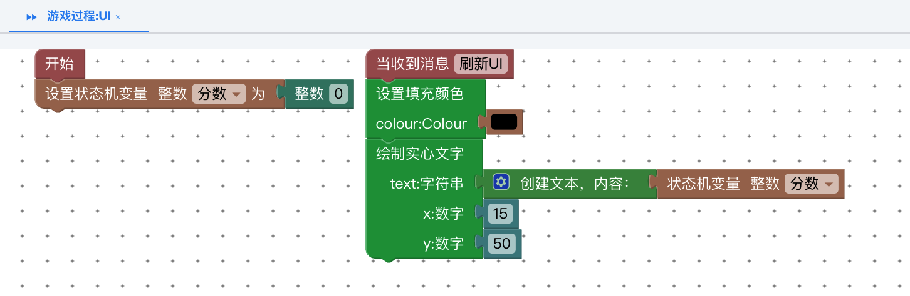
&ensp;&ensp;&ensp;&ensp;这时再运行看看效果，就不会出现得分和“点击屏幕开始”同时出现的问题了。

#### 角色初始化
&ensp;&ensp;&ensp;&ensp;在创建角色之后，我们应该为角色设定一个初始位置。如果我们在“等待”状态中设定初始位置，将导致每次回到“等待”状态后，角色都被重置到初始位置。所以我们可以考虑给角色一个“初始化”状态。我们为角色添加“初始化”状态，并将其设定为默认状态。
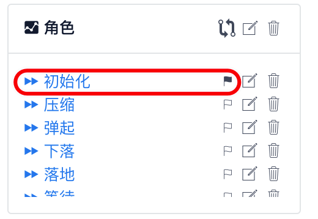

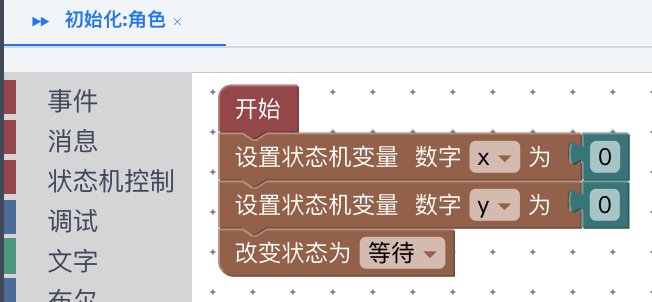

#### 偏移坐标
&ensp;&ensp;&ensp;&ensp;像UI一样，为了能够绘制角色，我们也为其设置一个渲染帧频。但是这个帧频与UI不同。UI帧频不需要考虑世界坐标的问题。但是为了简化绘制图形位置的计算，在游戏内容中的角色和每个平台都处于我们设定的虚拟空间坐标系中，而不是屏幕坐标系中，我们需要用一个简单的位置偏移来描述，并在绘制图形的时候，将偏移量计算到坐标上。
&ensp;&ensp;&ensp;&ensp;首先，我们创建一个数据结构组。

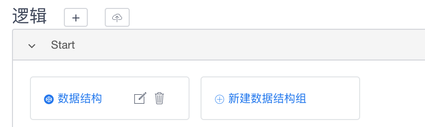
&ensp;&ensp;&ensp;&ensp;然后在分组里边创建坐标的结构。
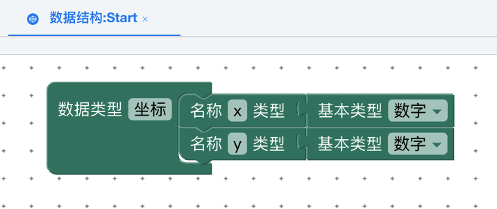

#### 游戏过程 3
&ensp;&ensp;&ensp;&ensp;有了坐标系统，我们就可以通过通过统一的偏移量来移动整个世界了。

作者：
[duzc2](gitee.com/duzc2)

