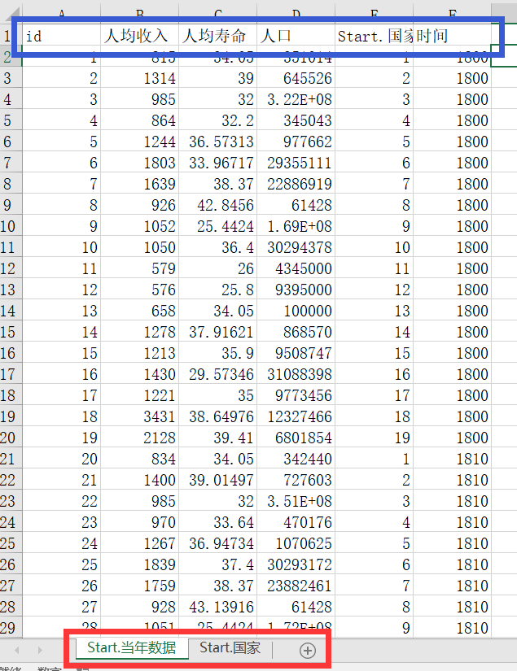

# 数据库使用方法
&ensp;&ensp;&ensp;&ensp;openblock支持数据库导入，导入文件为Excel表格
本文将介绍如何实现数据库功能。以[数据可视化DEMO](https://www.makeredu.net/frontpage/index.html#%7B%22proj%22:%22https://www.makeredu.net/testing/canvas/life-expectancy/project.json%22%7D)为例。

## 一、创建数据结构
 1、新建一个数据结构组并打开  

## 二、添加字段
 2、字段名称与Excel表格列名对应

 数据类型对应Excel表格的sheets,Excel表格中sheet命名格式要求为：模块名.数据类型名（见图用红色方框圈起来的部分）。蓝色矩形圈起来的部分为数据剧类型中对应的名称，注意在Excel各列单元格格式要与基本类型对应.映射元素类不需要在Excel表格填写，配合id自动在数据库生成数组。

作者：
[唐铭穗](https://gitee.com/tangtang0)
维护者：
[duzc2](gitee.com/duzc2)

