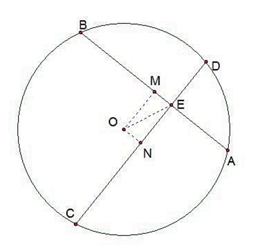
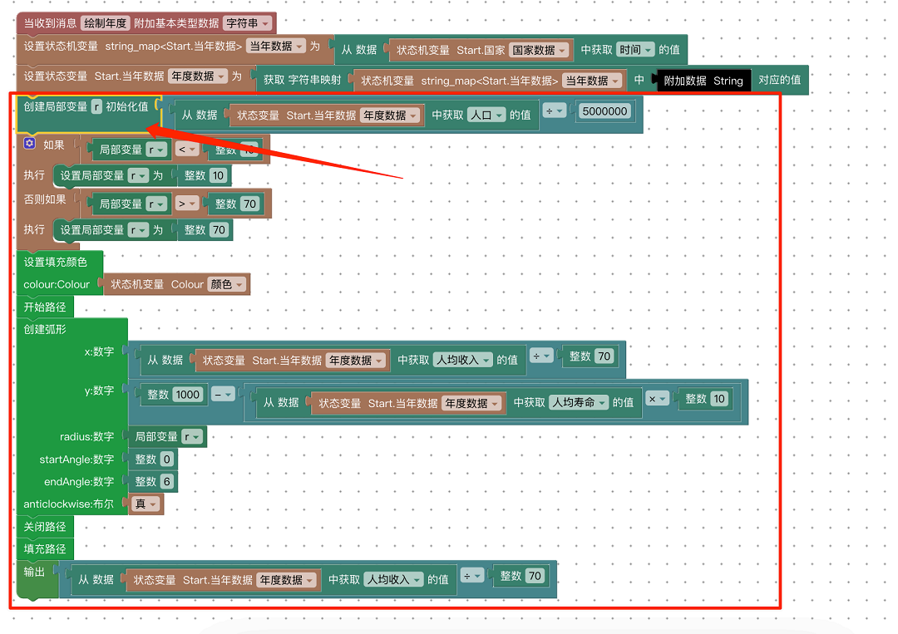
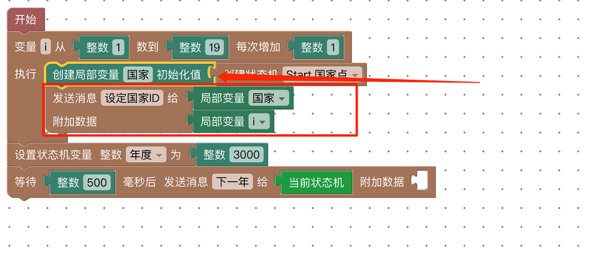

# 作用域

举例说明

我们在上学的时候，初中⼏何课的时候⽼师经常会说，设直线AB与直线CD相交与⼀点E 。

这是解题通常使⽤的⽅法：
当⽼师讲解完⼀道题，讲下⼀道题的时候，可能⼜会说：设直线AB与直线CD相交于⼀点E 。。

我们可以看到，这两道题⾥都出现了 ABCDEO 这⼏个点，虽然名称相同，但是所指代的具体点，是完全不同的。两道题⾥的A，完全是不相关的东⻄。⽽离开题⽬，我们说A，其实A并没有特殊的含义。这时候我们发现，这⼏个字⺟，只有在具体的题⽬中讨论，才有意义、才起作⽤。

这时时候我们就称第⼀题是点A的作⽤域，第⼆题是另外⼀个点A的作⽤域。
任何事物只有在其作⽤域内讨论才有意义。那么当我们在考试的时候，除了每道题⾥边有变量的作⽤域，设置实数的作⽤域:

再举例
在解某⼀道题的时候，我们
设：A=7
此时 A在整道题范围内，都为7，⽽在另外⼀道题⾥ ，可能根本没有A这个变量。这也是变量A的作⽤域为这道题内的意思。

那么，有没有作⽤域是超过题⽬的呢？

！！有 ！！

参照以下场景

我们的姓名，是写在卷头的，表示 这张卷⼦⾥所有的题⽬，都是我写的，姓名的作⽤域就是整张卷⼦。虽然在任何⼀道题⾥，都没有⽤到姓名这个变量，但是⽼师在判完卷⼦之后就知道，我这次考试得了多少分，都是因为卷头上有我的名字，⾥⾯每⼀道题的对错，都影响我的得分，⽽且只影响我的得分，不会影响别⼈的得分。所以 卷头的 班级、姓名、得分，都是以卷⾯为作⽤域的。

------------------------------------

提问？

那还有没有更⾼的作⽤域呢？ 我们可以想象⼀下，什么是超过卷⾯的作⽤域呢？
⽐如：我们⽤的 π，⽆论我们什么时候提及到这个字，都表示圆周率，我们就说 —— π 的作⽤域是整个数学领域。

在我们⽣活中，也有作⽤域的概念，⽐如“妈妈”，每个⼈都有妈妈，所以每
个⼈喊出的“妈妈”都指代不同的⼈。
考虑喊“妈妈”的⼈所处的环境，⽐如，他在演戏，那么他喊妈妈，指代的就是剧情⾥⻆⾊的妈妈，也是剧情⾥他的妈妈的扮演者，⽽不是演员的⺟亲。我们就说 此时的“妈妈”的作⽤域是剧情内。

还是这个演员，回到家，对着⾃⼰的⺟亲喊“妈妈” 这时候，⼤家都知道，这个“妈妈”指代的就是他的⺟亲，⽽不是别⼈。

------------------------------------

## 知识点

在OpenBlock中，我们将变量分为3个作⽤域，状态机、状态 和 局部，

这三个作⽤域内的变量，我们分别称为：__状态机变量__、**状态变量** 、 **局部变量**。

* __状态机变量__ ： 就是指，在状态机的任何⼀个状态内，都可以读写的变量。

* __状态变量__ ：就是指 在当前状态内的任何地⽅都可以读写的变量。在函数组中的任何函数，都不能写状态机变量和状态变量。状态机之间也不能互相读写对⽅的状态机变量和状态变量。同⼀个状态机内部，不同的状态之间，也不能互相读写变量。

* __局部变量__ ：⽐较复杂 [ 如下图：]

局部变量的作⽤域是 由 “创建局部变量”块开始，到其所在的语句块结束。

⽐如，国家变量，是局部变量，他的作⽤域就是从“创建局部变量‘国家’”开始，到循环体包围圈下限结束。

作者：
[杜天微](https://gitee.com/duzc2)
维护者
[边石坤](https://gitee.com/bian-shikun_admin)
