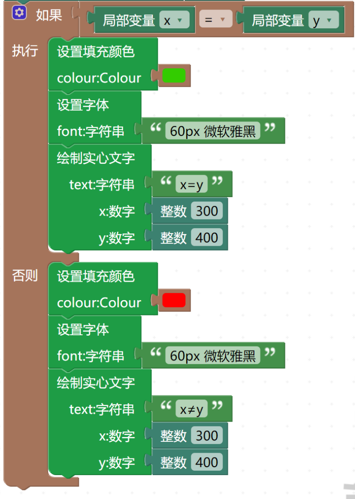

# 布尔运算实例

通过代码判断x与y的值是否相等

## 使用方法

1. 用浏览器打开编辑器（推荐使用谷歌浏览器）。 这里以 www.makeredu.net 为例，请根据使用方式使用合适的地址替换。 如图：

2. 点击加号，新建模块

3. 点击下拉箭头、选择新建状态机

4. 进入编程界面：点击“状态”按钮

---

## 案例实践

### 【1】设置局部变量

1. 拖动“事件”中的“开始”按钮，放到编程区：

2. 拖动两个“状态变量”中的“设置局部变量（）初始化值（）”连接“开始”

3. 在“数学”中拖动“整数（）”模块连接到局部变量创建模块后方

4. 更改变量名称为x和y，整数数字暂时设定为1

讲解

此处的x和y是变量，他们会作为参数进入后面的判断运算，初始化值代表在程序开始的时候在程序开始的时候把x和y的值设置为设定的整数

### 【2】设置判断条件

1. 在“布尔”中拖出模块“如果·执行”连接到设定局部变量模块下方

模块讲解：如果·那么 模块是指满足如果后面的条件就运行下方代码

2. 在“布尔”拖出“【】=【】”模块，连接到如果后方（本模块内容就是执行条件）

3. 在“局部变量”中拖出两个“局部变量【】”分别放在“【】=【】”的两个空格中，并分别修改局部变量名称为x和y

4. 点击“如果·执行”模块左上角的齿轮图标，在弹出窗口中将左侧的“否则”放到放到“如果”下方

注：第四步是为了在条件不成立的情况下进行输出

### 【3】编写条件成立时和不成立时的运行代码

文本输入代码的讲解：[文本输入代码的讲解](https://www.makeredu.net/docs/#manual/1_%E5%BF%AB%E9%80%9F%E4%B8%8A%E6%89%8B/1_%E5%BF%AB%E9%80%9F%E4%B8%8A%E6%89%8B.md)

### 【4】调试

1. 将x的初始值调整为2，将y的值调整为1，检查输出结果是否符合预期

2. 将x的初始值调整为1，将y的值调整为1，检查输出结果是否符合预期

源代码：

作者：[陈卓](https://gitee.com/xuesheng-chengxuyuan)
维护：
[杜天微](https://gitee.com/duzc2)