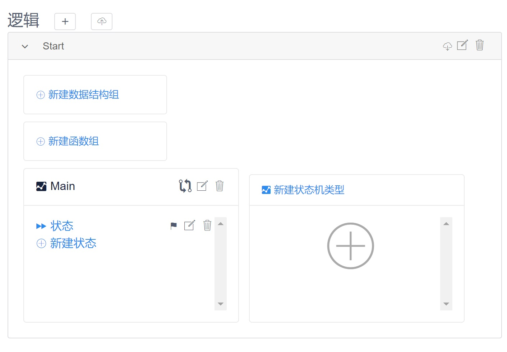
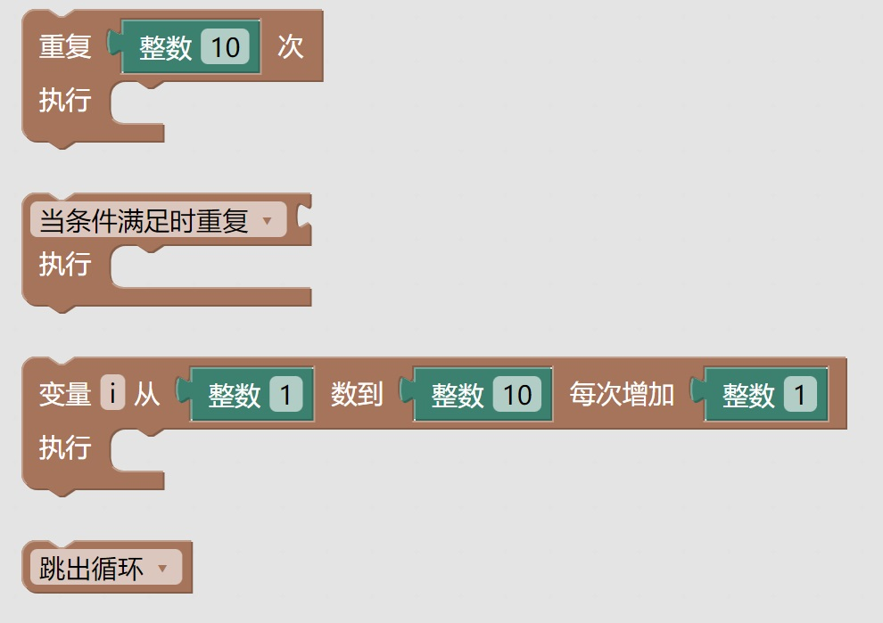
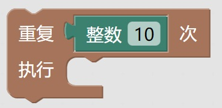
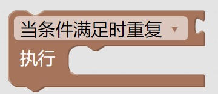
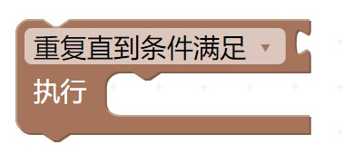
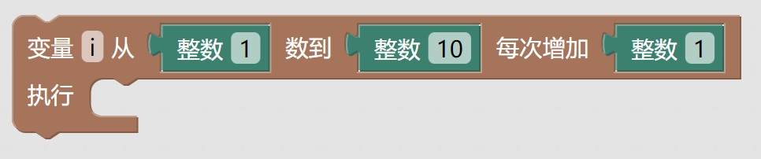
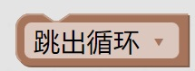

重复执行模块讲解
===
使用方法:
---
用浏览器打开编辑器（推荐使用谷歌浏览器）。 这里以 www.makeredu.net 为例，请根据使用方式使用合适的地址替换。

---------------------
1.创建状态机并添加状态

---
[快速入门](https://www.makeredu.net/docs/#manual/1_%E5%BF%AB%E9%80%9F%E4%B8%8A%E6%89%8B/1_%E5%BF%AB%E9%80%9F%E4%B8%8A%E6%89%8B.md)

-----------------
2.代码块讲解
---
在左侧列表中点开循环

点开后可以看见此列表中存在四个模块

------

### 1.重复【整数（）次】执行

讲解：本模块用于限定次数的重复执行，可以理解为，让计算机重复干同一件事（执行后面的模块）N次（N为输入的值）

-----------
### 2.当条件满足时重复/重复直到条件满足

本模块有两张形态

形态一：

讲解：本模块指判断条件满足时运行下方代码

形态二：

讲解：本模块指重复执行到满足某条件时停止运行，即结束循环

------
### 3.变量（）从整数（）数到（），每次增加（）

讲解：本模块指用变量（）计数，执行一次增加一个设定的值，当数值达到预定时，结束循环

----
### 4.跳出循环/进行下一轮循环

讲解：本模块指的是在执行循环体的过程中，不再执行循环命令，而是直接跳出循环体，继续执行循环语句后面的命令

------------
作者：陈卓